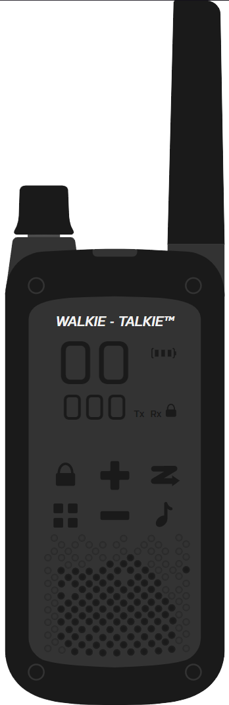
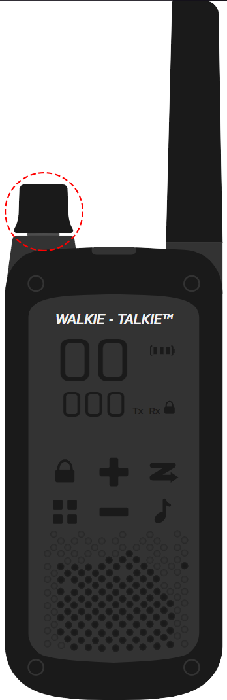
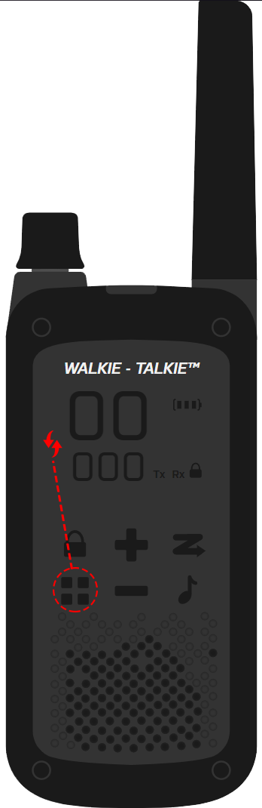
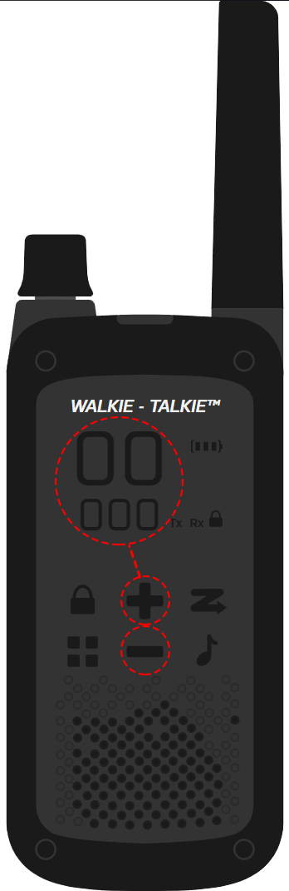
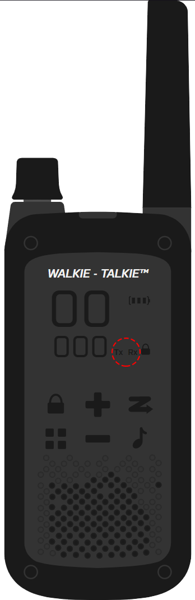
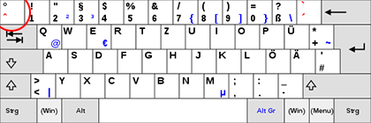
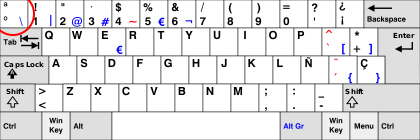

# Table of Content

- [Table of Content](#table-of-content)
  - [Introduction](#introduction)
  - [Installation](#installation)
  - [Usage](#usage)
    - [Layout](#layout)
    - [Power on -/ off](#power-on---off)
    - [Channels & Sub Channels](#channels--sub-channels)
    - [Transmit & Recieve](#transmit--recieve)
    - [Hotkeys](#hotkeys)
      - [QWERTZ](#qwertz)
      - [QWERTY](#qwerty)
  - [License](#license)
  - [Bugs & Erros](#bugs--erros)
  - [Changelog](#changelog)

---

## Introduction

A Walkie - Talkie, which implements a Roleplay ready immersion of an real HT. 
It allows you to communicate within huge distances, with realistic radio sounds which adds a deeper expierence for the User! 

## Installation

You'll find the following files:
| Walkie - Talkie |
| --------------- |
| preview |
| src |
| readme |

Besides the previews which include a revamp of the [Usage - Part](##Usage) , you'll find a Folder called `src` 
This is the alt:V Ready resource, name it however you want. 

---

We'll name it `walkie-talkie` 
Once you renamed `src` => `walkie-talkie` , place the Folder inside your Servers Resource. 
Followed by adding the name `walkie-talkie` within the .cfg to ensure it loads.

## Usage

We'll go further and explain the buttons & features, you can also view those Images inside the Folder `preview`

### Layout

This is the general Layout of the Walkie - Talkie 

### Power on -/ off

Turning the Device on goes as fast, as you can scream into it 

### Channels & Sub Channels

Once activated, you'll automaticly adjust the value of the Channel. 
But you can easily change to Sub Channels 
 
 
The choosen values will be shown active in a noticeable color 
You can increase & decrease the Value with the Icons `+` and `-`  
 
 

### Transmit & Recieve

**Tx** => Transmitting 
**Rx** => Revieving 

There for you most likely understand what those Indicators do. 
Once you setup your alt:V Voice & the Walkie - Talkie, you're free to transmit your beautiful voice: 

 

### Hotkeys

Finished setting everything up? Alright! Time to say `Hello World` 
Check the Table and find the Hotkey based on your Keyboard Layout!

| Layout          | Hotkey | Reference            |
| --------------- | ------ | -------------------- |
| QWERTZ - Layout | ^      | [QWERTZ](####QWERTZ) |
| QWERTY - Layout | \      | [QWERTY](####QWERTY) |

#### QWERTZ

 

#### QWERTY

 

## License

Code: `DatMayo / Oiramix ツ#9505`

Design: `Carbon™#1000`

## Bugs & Erros

In the first version ([See Changelog](##Changelog)), weren't any bugs or similar noticable. 
Keep in mind that's a early version, some buttons might lack functionality.

If you should find any bugs afterall: 
[GitHub Issues](https://github.com/AltV-Projects/Walkie-Talkie/issues) 

## Changelog

| Version | Date          | Description     |
| ------- | ------------- | --------------- |
| 1.0.0   | 22th May 2020 | Initial Release |
